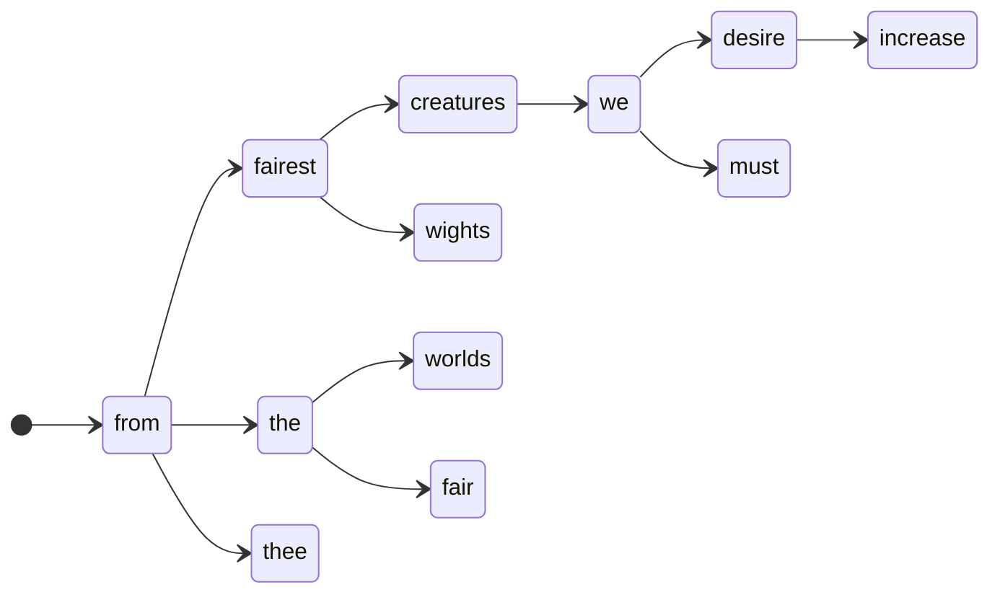

# Markov Chain DADA Poetry Generator

A simple Node.js application that generates random text inspired by Tristan Tzara's DADA poetry technique. The program uses Markov chains to create associations between words from an input text file and generates new, randomized output.

## How It Works

1. The app reads a text file provided as a command-line argument
2. Converts the text into a Markov chain model where each word points to possible following words
3. Generates a new sequence of words by randomly walking through the chain
4. Outputs the result to the console as a DADA-style poem

Each word is a state; each transition is an edge to a word that has followed it in the source text. Every distinct follower is stored once, so generation is a *uniform* random walk — at every step each outgoing edge is equally likely, no matter how often that transition occurred in the corpus. (Using the frequencies as weights is exactly what the probability-based variant in [`../probability-markov/`](../probability-markov/) adds.)



```js
{
  william: [ 'shakespeare' ],
  shakespeare: [ 'from' ],
  from: [
    'fairest',  'highmost',  'the',    'his',
    'that',     'youth',     'heat',   'thine',
    'thyself',  'you',       'fair',   'faring',
    'far',      'thee',      'sullen', 'woe',
    'mine',     'me',        'loves',  'thy',
    'limits',   'hands',     'whence', 'where',
    'home',     'memory',    'times',  'these',
    'this',     'variation', 'hence',  'thence',
    'expense',  'their',     'my',     'your',
    'limbecks', 'accident',  'myself', 'serving',
    'those',    'heaven',    'hate',   'what'
  ],
  fairest: [ 'creatures', 'wights', 'and', 'in', 'votary' ],
  creatures: [ 'we', 'broke' ],
  we: [
    'desire',   'two',
    'must',     'know',
    'it',       'are',
    'which',    'our',
    'sicken',   'purge',
    'admire',   'before',
    'see',      'prove',
    'flatterd'
  ],
  // ...
}
```

"From thee" appears ten times in the sonnets and "from fairest" once, but the
chain stores each follower once: `thee` and `fairest` are equally likely next
steps out of the 44 recorded for `from`. Transition frequency is thrown away —
that blindness is this model's defining limitation.

## Usage

```bash
node index.js <path-to-text-file> [output-length]
```

Examples:

```bash
# Default output length (30 words)
node index.js sample.txt

# Custom output length (50 words)
node index.js sample.txt 50
```

## Requirements

- Node.js

## Technical Details

The Markov chain implementation:

- Splits input text into words, removing punctuation
- Creates a dictionary where each word maps to an array of the *distinct* words that follow it in the original text
- Generates new text by selecting uniformly at random from these arrays based on the previous word — every recorded follower has an equal chance
- When a word has no followers, a new random word is selected

The generated poem is 30 words long by default, but you can specify a custom length as the second command-line argument.

(c) 2025 Vincent Bruijn <vebruijn@gmail.com>
